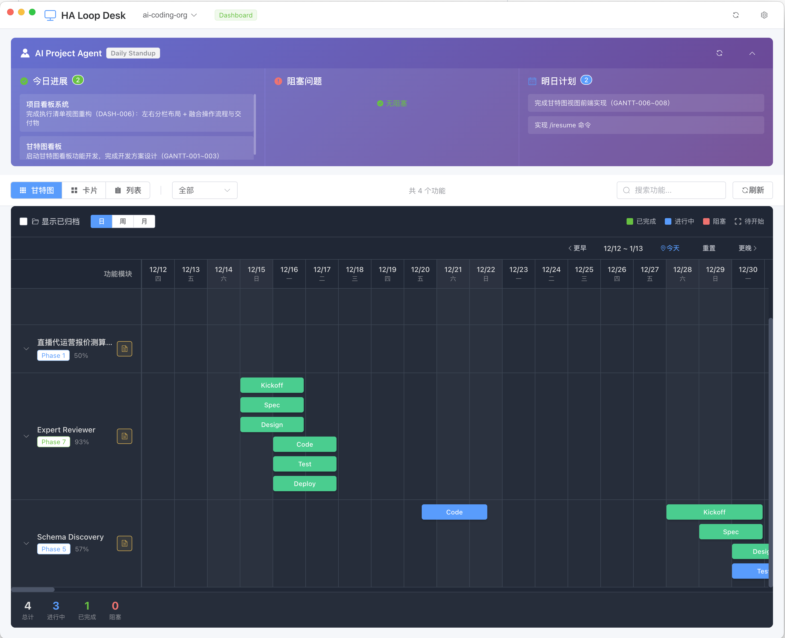

# HA Loop Desk

> **Human-AI Loop Desk** - 人机协作循环可视化工作台

## 1. 这是什么？

**HA Loop Desk 是 [AI Coding Template](https://github.com/oowanghuan/ai-coding-template) 的可视化伴侣工具。**

### 解决的核心问题

使用 Claude Code CLI 进行人机协作开发时，你需要：
- 记住 10+ 个 Slash Commands（`/new-feature`、`/check-gate`、`/next-phase`...）
- 记住 8 个开发阶段的流转顺序
- 记住每个阶段需要产出什么文档
- 记住 Phase Gate 的审批流程

**这些「需要记在脑子里」的东西，HA Loop Desk 全部可视化出来了。**

### 核心能力

| 能力 | 说明 |
|------|------|
| **可视化工作流** | 8 阶段流程不用记，界面上直接看到当前在哪、下一步去哪 |
| **点击即执行** | 不用手敲命令，点击按钮直接发送 Slash Command 到 CLI |
| **进度一目了然** | 甘特图展示多功能模块进度，Daily Standup 面板展示每日工作 |
| **Gate 状态可视** | Phase Gate 审批状态、阻断原因，全部可视化展示 |

### 降低使用门槛

```
传统 CLI 使用方式                    HA Loop Desk 使用方式
════════════════════                ════════════════════════

1. 打开文档查命令                    1. 看界面，点按钮
2. 手敲 /check-gate user-auth       2. 完成 ✓
3. 看输出，理解状态
4. 再查文档，下一步是什么
5. 手敲 /next-phase user-auth
...

记忆负担：高                         记忆负担：几乎为零
出错概率：高                         出错概率：低
```

**简单说**：
- Claude Code CLI 是你的「手」— 执行具体操作
- HA Loop Desk 是你的「眼睛」— 看清全局 + 「遥控器」— 点击操作

```
┌─────────────────────────────────────────────────────────────────┐
│                                                                 │
│   AI Coding Template              HA Loop Desk                  │
│   ════════════════════            ═══════════════               │
│   框架 + 模板 + CLI               可视化 + 遥控器                │
│                                                                 │
│   Slash Commands                                                │
│   ├── /new-feature         ←───   🖱️ 点击「新建功能」按钮       │
│   ├── /check-gate          ←───   🖱️ 点击「检查 Gate」按钮      │
│   ├── /next-phase          ←───   🖱️ 点击「下一阶段」按钮       │
│   └── /end-day             ←───   🖱️ 点击「结束今天」按钮       │
│                                                                 │
│   进度数据                                                       │
│   ├── 90_PROGRESS_LOG.yaml  ──→   📊 甘特图进度视图             │
│   └── PHASE_GATE_STATUS.yaml ──→  🚦 Phase Gate 状态            │
│                                                                 │
└─────────────────────────────────────────────────────────────────┘
```

## 2. 界面预览

### Dashboard - 项目总览



*左侧甘特图展示多功能模块进度，右侧 Daily Standup 面板展示每日工作*

### Workspace - 功能工作台


*阶段导航 + 工具面板 + 执行清单，聚焦单个功能模块的开发*

## 3. 快速开始

### 前提条件

你需要先有一个使用 [AI Coding Template](https://github.com/oowanghuan/ai-coding-template) 结构的项目。如果还没有，请先按照 AI Coding Template 的文档创建项目。

---

### 3.1 让 AI 帮你开始（推荐）

> **给 AI 看的版本**：如果你正在使用 Claude Code，可以让 AI 直接读取初始化文档来配置 HA Loop Desk。
> 只需说：「读取 CLAUDE_INIT_HALOOP.md 并帮我配置 HA Loop Desk」

AI 会读取 [CLAUDE_INIT_HALOOP.md](./CLAUDE_INIT_HALOOP.md) 并自动完成配置。

---

### 3.2 下载 Release 运行

从 [Releases](https://github.com/oowanghuan/ha-loop-desk/releases) 下载适合你系统的版本：

| 平台 | 下载文件 |
|------|----------|
| macOS (Apple Silicon) | `HA.Loop.Desk-x.x.x-arm64.dmg` |
| macOS (Intel) | `HA.Loop.Desk-x.x.x-x64.dmg` |
| Windows | `HA.Loop.Desk-x.x.x-setup.exe` |

**使用流程**：

1. **安装并启动 HA Loop Desk**
2. **选择项目目录** - 选择你的 ai-coding-template 项目根目录
3. **查看 Dashboard** - 看到所有功能模块的进度甘特图
4. **进入 Workspace** - 点击某个功能模块，查看详细的阶段和任务

---

### 3.3 从源码运行

如果你想参与开发或需要自定义功能：

```bash
# 克隆仓库
git clone https://github.com/oowanghuan/ha-loop-desk.git
cd ha-loop-desk

# 安装依赖
npm install

# 启动开发模式
npm run dev

# 构建应用
npm run build:mac   # macOS
npm run build:win   # Windows
```

---

### 数据来源

HA Loop Desk 读取项目中的以下文件（由 Claude Code CLI 自动生成和更新）：

| 文件 | 用途 |
|------|------|
| `docs/{feature}/90_PROGRESS_LOG.yaml` | 功能进度和任务状态 |
| `docs/{feature}/PHASE_GATE_STATUS.yaml` | Phase Gate 状态 |
| `PROJECT_DAILY_STANDUP.yaml` | Daily Standup 数据 |

**重要**：HA Loop Desk 是**只读**的，它不会修改你的项目文件。所有数据更新都通过 Claude Code CLI 完成。

## 4. 延伸思考：不只是软件开发

> **注意**：以下是关于 HA Loop Desk 更深层的思考。如果你只是想配合 AI Coding Template 使用，上面的内容已经足够。

### 这个工具是怎么来的？

```
演进路径：

1. AI Coding Template
   └─ 一套 AI 协作开发的框架和流程
   └─ 用着用着发现：流程太多，记不住

2. 需要一个看板
   └─ 把流程可视化出来
   └─ 于是有了 HA Loop Desk

3. 做完看板后的发现
   └─ 这其实是一个 Human-AI Loop 的工作流
   └─ 人和 AI 在同一个循环里协作：
      - AI 执行任务、更新状态
      - 人审批 Gate、做决策
      - 看板让双方都能看到全局

4. 更大的可能性
   └─ 既然是 Human-AI Loop...
   └─ 那其他需要「人机协作」的业务流程，是不是也能用？
```

### Human-AI Loop 的本质

HA Loop Desk 的名字里藏着它的本质：**Human-AI Loop**。

软件开发只是第一个落地场景。任何需要「人机协作、阶段推进、质量把关」的流程，理论上都可以用这套模式：

| 场景 | Human 的角色 | AI 的角色 | Gate 的意义 |
|------|-------------|----------|------------|
| 软件开发 | 审批设计、验收代码 | 写代码、生成文档 | 质量把控 |
| 内容创作 | 定主题、审终稿 | 写初稿、做调研 | 内容质量 |
| 产品设计 | 拍板需求、评审原型 | 生成方案、做竞品分析 | 方向把控 |
| ... | ... | ... | ... |

### 开放性问题

哪些业务流程真正适合 Human-AI Loop 模式？这是一个需要继续探索的问题。

我们把软件开发这个场景做扎实了，但其他场景的适配还需要更多实践。如果你有想法，欢迎探索。

### 自定义工作流（实验性）

如果你想尝试其他场景，可以通过修改 `presets/` 目录下的配置文件：

```yaml
# presets/my-workflow/preset.yaml
name: "My Custom Workflow"
phases:
  - id: 1
    name: "Planning"
    display_name: "规划"
    required_outputs:
      - "PLAN.md"
    gate_rules:
      approvers: ["PM"]
  - id: 2
    name: "Execution"
    display_name: "执行"
    required_outputs:
      - "RESULT.md"
    gate_rules:
      approvers: ["Owner"]
```

## 5. 技术栈

- **框架**: Electron + Vue 3
- **UI**: Element Plus
- **状态管理**: Pinia
- **构建工具**: electron-vite

## 6. 相关项目

| 项目 | 说明 |
|------|------|
| [AI Coding Template](https://github.com/oowanghuan/ai-coding-template) | AI 协作开发框架模板（必需） |

## License

MIT

---

_HA Loop Desk - 让 AI 协作开发进度可视化_
